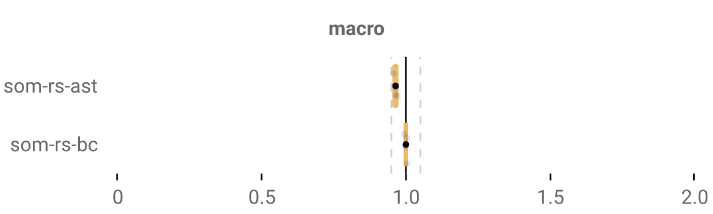
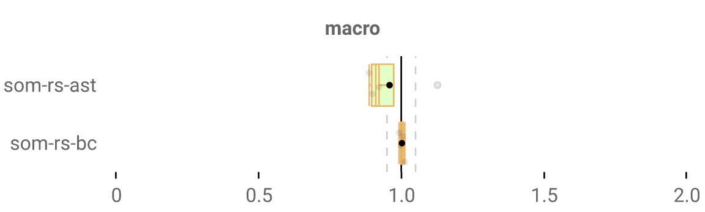
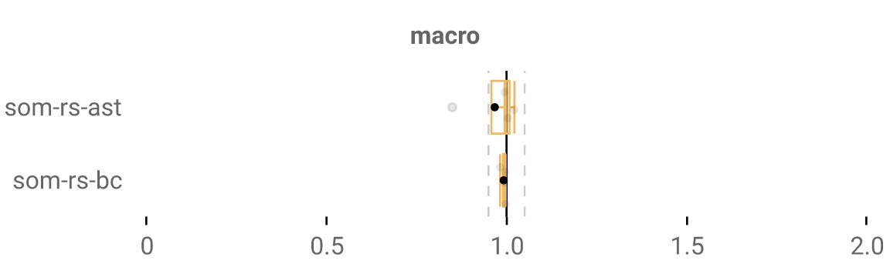
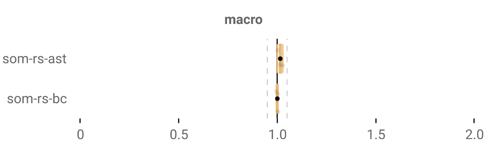
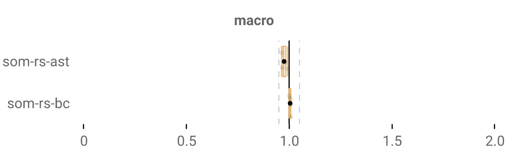
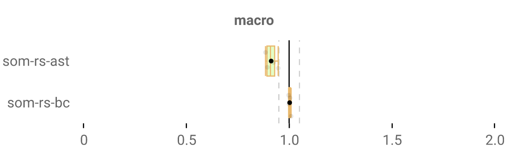

This is part of a series of blog posts relating my experience pushing the performance of programming language interpreters written in Rust. For added context, read the start of [last week's blog post]().

If you don't want to do that, in short: we optimize AST+BC Rust-written implementations of a Smalltalk-based research language called [SOM](http://som-st.github.io/), in hopes of getting them fast enough to meaningfully compare them with other SOM implementations.

As a general rule, all my changes to the original interpreter (that led to speedups + don't need cleaning up) are present [here](https://github.com/OctaveLarose/som-rs/tree/best). This week's code is [in its own branch](https://github.com/OctaveLarose/som-rs/tree/ast-interp-inline-caching), since it relies on ugly code (explanations further below). TODO: specific commit

...and benchmark results are obtained using Rebench, then I get cool numbers and graphs using RebenchDB. In fact, you can check out RebenchDB and all of my results for yourself [here](https://rebench.stefan-marr.de/som-rs/), where you can admire A) RebenchDB being very useful, well made software and B) the stupid names I give my git commits to amuse myself.

### inline caching?

Inline caching is a very widespread optimization in dynamic programming language implementation. If you're reading this kind of blog, chances are you've already heard of it; and if you haven't, I will derive some irrational enjoyment from being the first to explain it to you.

Say you have this code:

```
benchmarkClass := loadBenchmarkClass: "BubbleSort".
benchmarkClass runBenchmark.
```

Since we're working with a dynamic language, `benchmarkClass` can be any class at all: it can be `True`, it can be `Integer`, it can be `Whatever`, etc. Whenever you've got a method call (a.k.a a "message": sending the receiver a message "please execute your method of the given name"), you can't make any assumptions at compile-time about what class the method is going to get invoked on.

This is annoying since that means that at every method call site, once you find out what the class is, you need to look up the method in that class to be able to then execute it. That takes a bit of time for every single call, and basically everything under the sun is a call in SOM, so that's slow.

So why not cache the result of those lookups, so that they don't have to be done every single time? That'd make it so that whenever we call anything, we check the receiver we cached and we invoke it on that instead.

What if the receiver changes?
- then we make it so that our cache has several entries, and cache all possible receivers.

What if there's so many receivers that caching is impractically expensive?
- this is not an issue in practice! As it turns out, a method call is rarely invoked with that many different classes: most calls are *monomorphic*, a fancy term for saying "only one possible caller".[TODO put sophie's paper there maybe?].
  - We wrote a paper in 2022 on the behavior of Ruby codebases, [which you can read here](https://stefan-marr.de/downloads/dls22-kaleba-et-al-analyzing-the-run-time-call-site-behavior-of-ruby-applications.pdf), in which we observed about 98% of the call-sites in large benchmarks to be monomorphic. Granted this is for the Ruby language and not SOM, but they're both highly dynamic enough to be comparable.

- most implementations add a `am_i_megamorphic` (*megamorphic* as in a lot of possible callers) check to callsites, and if we've observed too many receivers in the past, we stop caching and looking up entries entirely, only doing a generic lookup.

Cool. And those caches may as well be stored at the call sites themselves, therefore be *inline*, hence the name.

### inline caching in our bytecode interpreter

Inline caching is already implemented in the bytecode interpreter, and looks like this:

```rust
fn resolve_method(frame: &SOMRef<Frame>, class: &SOMRef<Class>, signature: Interned, bytecode_idx: usize) -> Option<Rc<Method>> {
    let mut inline_cache = unsafe { (*frame.borrow_mut().inline_cache).borrow_mut() };

    let maybe_found = unsafe { inline_cache.get_unchecked_mut(bytecode_idx) };

    match maybe_found {
        Some((receiver, method)) if *receiver == class.as_ptr() => {
            Some(Rc::clone(method))
        }
        place @ None => {
            let found = class.borrow().lookup_method(signature);
            *place = found
                .clone()
                .map(|method| (class.as_ptr() as *const _, method));
            found
        }
        _ => class.borrow().lookup_method(signature),
    }
}
```

Every bytecode has its own associated inline cache. It's empty most of the time - you don't need to cache anything for a `POP` bytecode - but will get entries for `SEND` bytecodes. Whenever you resolve a method, you check whether the inline cache has an entry for this bytecode, and what the cached receiver and methods are: if the cached receiver is the same as the current receiver, then we can just call the method. Otherwise, we do a lookup and put the method in the cache.

Note that this is an inline cache of size one. That's because [adding more entries was not that beneficial to performance, with our benchmarks](https://github.com/Hirevo/som-rs/pull/31). We'll try varying the number of entries in the AST implementation, and see if it's the same as in the BC.

Rust side note: this is also a good example of us using pointers + `unsafe` to sneak in some performance:
1. `*frame.borrow_mut().inline_cache`: inline caches are stored in `Method` structs directly. Frames keep a pointer to them for fast access, and dereferencing a pointer is unsafe.
We could theoretically use `&` (i.e. a standard Rust reference) instead, but those come with the burden of informing the compiler about lifetimes, which is far from straightforward in this case; we the (very) smart (and cool) programmers know that a method and its inline cache will definitely outlive any frame that relies on them.
2. `inline_cache.get_unchecked_mut(bytecode_idx)`: we know there's as many inline cache entries as there are bytecodes, so we may as well avoid the safety check a regular `get()` call would induce.

### rust hates AST interpreters

Now we want to implement it in the AST. Unfortunately for us, this may be a case where the choice of the Rust language may not be the best.

Our AST is currently immutable. It just so happens that [self-optimizing ASTs are key to good performance](https://dl.acm.org/doi/10.1145/2384577.2384587), so we've got an issue.

To implement inline caching, we'd want to implement the cache _inline_ in the AST directly, so e.g. have a `MethodCallNode` that we modify to cache stuff directly in it. That requires said node to have a mutable state; and if you know anything about Rust, you can foresee how that could easily cause issues.

Easy fix in theory: nodes get invoked with `fn evaluate(&self, ...)` - instead let's make them use `fn evaluate(&mut self, ...)`! And we change many things around and we run it aaaaand:

```rust
thread 'main' panicked at somewhere/in/my/code
already mutably borrowed: BorrowError
```

...aaand that makes a lot of sense since Rust ownership is all about either having many immutable borrows or ONE mutable borrow. If whenever we call a method, we borrow it mutably, then a simple recursive call from inside that method will need to also mutably borrow the same method, and we're already toast - and that's one of several pitfalls with this approach.

Changing the design of the AST interpreter so that it can be self-modifying has been in my todo list since the start of this project. It's hard, if just to wrap my head around how it would be best to go about it. So let's circumvent that for now: the current quick """fix""", is... using a lot of raw pointers instead of safe `Rc<RefCell<T>>` types, and peppering the code with a million uses of `unsafe`. Is this bad? Yeah! Does it work? Also yeah!

No more Rust compiler guarantees though, and that's kind of Rust's whole thing, so we might as well be working with C at this point. Shame. This is *absolutely* something that I want to fix, and will fix in the future - and it should make for a decent blog post when I do.

### unsafe is actually good?

Making the interpreter unsafe is a mild speedup:



...very likely from avoiding safety checks and no longer having to increase reference counters. This makes me think that even if I stop using this horribly unsafe AST interpreter, there's potential for some mindful usage of `unsafe` to get little speedups like this.

As time goes on, I'm probably going to have to lean more and more on the `unsafe` side to get more performance out of our systems. It'll be interesting to find out how much, exactly: would Rust even still be that interesting a language choice if we end up having to omit most of its safety guarantees?

My expectation is that I shouldn't care at all, and that I'll never get to the point that most of the codebase uses `unsafe`. In the work of [Yi Lin et al. on high performance garbage collection](https://www.steveblackburn.org/pubs/papers/rust-ismm-2016.pdf), they found that few uses of `unsafe` were necessary to still get high performance. This is for garbage collection and not PL implementation like we're doing, but it's similar enough to make me believe that good software engineering can circumvent abusing ugly unsafe code.

### rust semantics also hate self-optimizing nodes

The way I wanted to implement inline caching mirrors how we do it in our other AST interpreters: replacing an unoptimized `NormalMessageNode` with a *specialized*, optimized `CachedMessageNode`. Something like this:

```rust
#[derive(Debug, Clone, PartialEq)]
pub enum MessageEnum {
    Uninitialized(Message),
    Cached(CachedMethodDef, ClassIdentifier, Message)
}
```

Turning normal `Uninitialized` messages into `Cached` ones, which are the same but with a cached method and class, and still able to call the generic case with their `GenericMessage` entry.

So to replace an uninitialized node, we'd do something like this:
```rust
*self = ast::Message::Cached(method_def, class_identifier, self.message);
```

Sounds good, right? We replace it and transfer ownership of the messag... wait this code fails because I can't transfer ownership in Rust actually oops

Really, it should be allowed: I want to tell Rust to transfer ownership of the `GenericMessage` from the node to its new, optimized version. My understanding is that this fails because creating this new node and assigning it to `self` are two distinct operations, indicating that the new node takes ownership of `self.message` when really `self` always has ownership of the message.

If anyone knows how this is achievable, I'd love to know. Is there a way to use `std::mem::replace` somehow, or has someone made some crate that addresses this?

### rust-friendly working version

Self-replacement is a no-go, so we're no longer replacing the Message itself. Instead, a `Message` is now bundled with its cache in a big old `MessageCall` :

```rust
#[derive(Debug, Clone, PartialEq)]
pub struct MessageCall {
    pub message: Message,
    pub inline_cache: Option<(usize, usize)>
}
```

[TODO describe behavior here]



Neat!

We've got one outlier here: `NBody`.

Two entries (`(Option<(usize, usize)>, Option<(usize, usize)>`): well, NBody likes it more! The rest feels lukewarm about it. Probably because most calls are monomorphic

Comparing two entries with one entry:




How about seven elements? `pub inline_cache: Box<[Option<CacheEntry>; 7]>` ?



<!-- And we add a `is_megamorphic` flag to -->

### linked lists

...are a bad idea in Rust, [say smart people](https://rust-unofficial.github.io/too-many-lists/index.html#an-obligatory-public-service-announcement). But I'm also occasionally smart[^smart]

but in our case it sounds smart!

```rust
#[derive(Debug, Clone, PartialEq)]
pub struct CacheEntry {
    class_ptr: usize,
    method_ptr: usize,
    next: Option<Box<CacheEntry>>,
}

#[derive(Debug, Clone, PartialEq)]
pub struct MessageCall {
    pub message: Message,
    pub inline_cache: Option<Box<CacheEntry>>,
}
```



Only a minor speedup, interestingly.

### final results

OK OK here we are



All our tweaks really didn't improve much on the original, single entry inline cache. Results aren't insanely good, which is actually expected: when Nicolas implemented it for the bytecode interpreter, [we got similar numbers](https://github.com/Hirevo/som-rs/pull/13).


---

[^smart]: Roughly 13.6% of the time