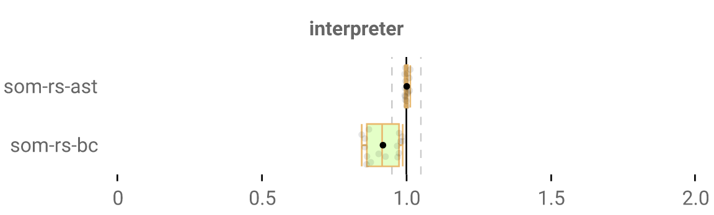
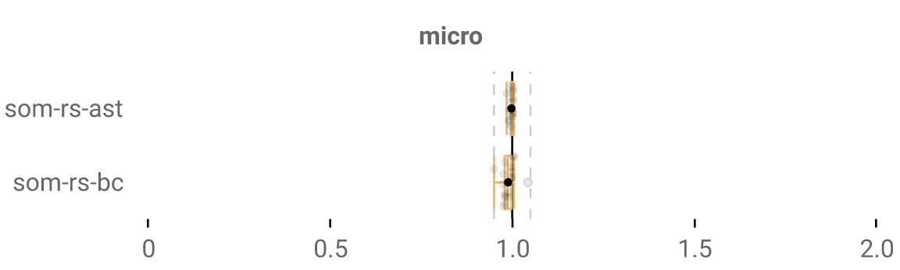
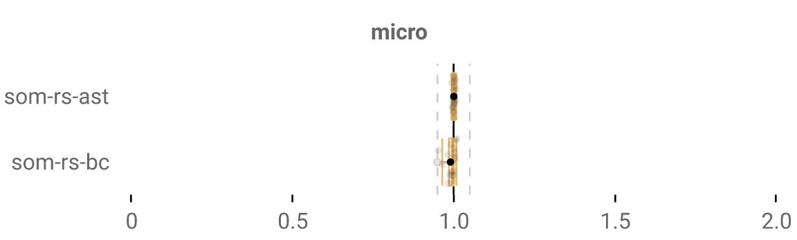
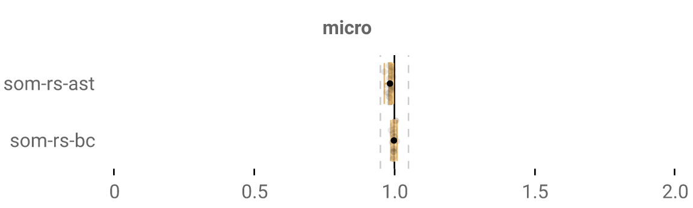
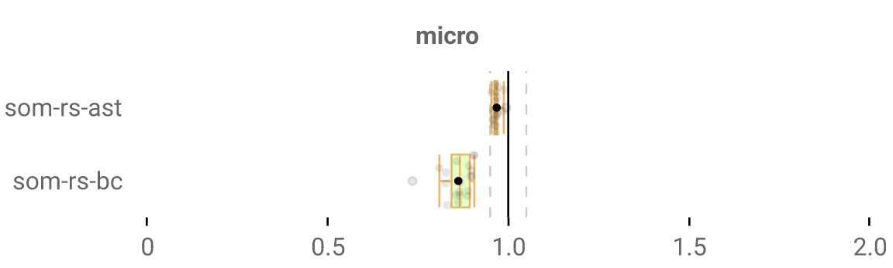
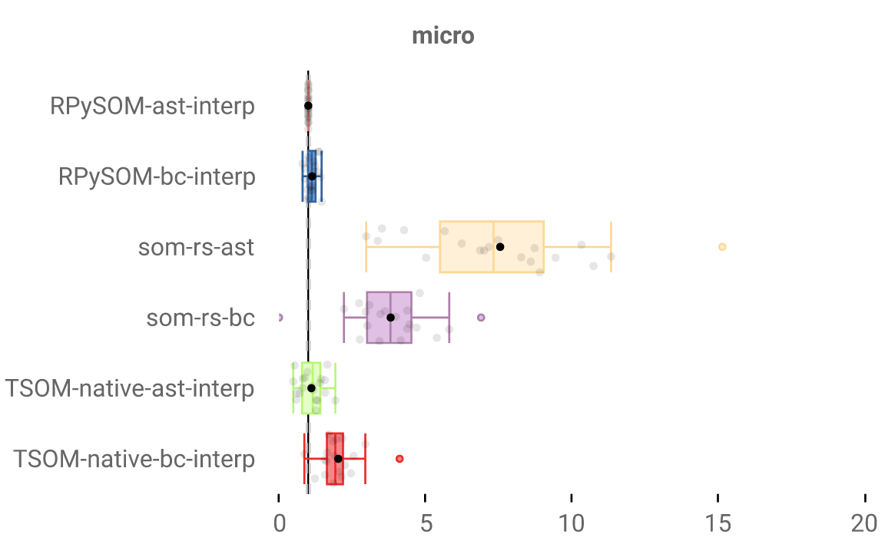

This is part of a series of blog posts relating my experience pushing the performance of programming language interpreters written in Rust. For added context, read the start of [my first blog post]().

In short: we optimize AST (Abstract Syntax Tree) and BC (Bytecode) Rust-written implementations of a Smalltalk-based research language called [SOM](http://som-st.github.io/), in hopes of getting them fast enough to meaningfully compare them with other SOM implementations. The ultimate goal is seeing how far we can push the AST's performance; the BC is meant to be a point of comparison.

As a general rule, all my changes to the original interpreter (that led to speedups + don't need code cleanups) are present [here](https://github.com/OctaveLarose/som-rs/tree/best).

...and benchmark results are obtained using [Rebench](https://github.com/smarr/ReBench), then I get performance increase/decrease numbers and cool graphs using [RebenchDB](https://github.com/smarr/ReBenchDB). In fact, you can check out RebenchDB in action and all of my results for yourself [here](https://rebench.stefan-marr.de/som-rs/), where you can also admire the stupid names I give my git commits to amuse myself.

## what have i been doing

I've mostly just been fixing bugs. I've been informed that having failing tests in your interpreter is in fact _not advisable_, so I had to be a good guy and fix those. I did most of that... But I was also doing something I invented called "procrastination" where instead of doing the right thing, I work on the fun bits of my work instead: squeezing more performance out of my systems. If anyone's curious:
- I fixed some major oversight in the AST that gave us like 40% median performance - it was frequently, needlessly cloning entire blocks. I thought that was a deep-rooted issue but it turned out not to be too bad a change, so that's very cool for me.
- I improved the dispatch in the AST, which was overly complex. Pretty sure the biggest win there was that this allows me to initialize method/block frames with their arguments directly, while previously they'd get created with an empty `Vec` and have arguments copied in them afterwards.
- I implemented `to:do:` (and friends like `to:by:do:`) in the AST interpreter! which was so much more straightforward than [it was for the BC interpreter]()). That's like another 40% median speedup.

## why are we so slow?

My PhD supervisor recently added a bunch of [the microest benchmarks](https://github.com/SOM-st/SOM/pull/121), designed to test out very basic operations: `ArgRead` does nothing but read arguments over and over again, `FieldReadWrite` just reads/writes to fields, this kind of stuff. And even on basic operations like these, som-rs is super slow: an `ArgRead` has a median runtime of 3.37ms on our fastest bytecode interpreter, versus... 49.23ms on som-rs. Something's way wrong.

So I've been doing profiling to investigate which parts of our interpreters are slower than they could be. I focused on the BC interpreter for this job since it feels like it should be much faster. And for the most part [^for-the-most-part], there weren't really any clear answers: we mostly seem to just be spending too much time in the interpreter loop.

I made a new branch `why-are-we-so-slow` and I started experimenting. I did a bunch of small changes that yielded a few % of speedups: for instance, I changed
```rust
let bytecode = unsafe { (*self.current_bytecodes).get(self.bytecode_idx) };
```
...to:
```rust
let bytecode = *(unsafe { (*self.current_bytecodes).get_unchecked(self.bytecode_idx) });
```

We were using `unsafe` since we were storing a pointer to the current bytecodes in the bytecode loop for fast access. Which made me think "we're already using `unsafe`, might as well also call `get_unchecked` for more performance": this code never fails as the bytecode index never increases past the number of bytecodes in a function. That's because the final bytecode in a method or a block is always a `RETURN` of some kind: if a method doesn't return anything explicitly, it returns itself, and we return to the previous function.

Theoretically a `JUMP` could increase the bytecode index to an incorrect value, say 100000... but here's how I draw the line for optimizations: I choose to believe that **my bytecode compiler is trustworthy**, and that any code that is unsafe based on that assertion is a valid choice. I could be shooting myself in the foot since there may be bugs in my compiler, but I think trusting it is a fair assumption to make: it's been proving sturdy enough, and if the bytecode I generate is incorrect, my code will fail miserably anyway or act very weirdly anyway. So it's a choice between not trusting my compiler + potentially failing "elegantly", or trusting it (by using unsafe) + potentially failing with ugly segmentation faults.

## unsafe frame accesses

Trusting the bytecode compiler means that whenever our bytecode requests a given argument, we know that this argument does in fact exist.  Which means that when we currently look up an argument with this code:

```rust
pub fn lookup_argument(&self, idx: usize) -> Option<Value> {
    self.args.get(idx).cloned()
}
```

...if we **know** that the bytecode we emitted is correct, then this `get` will never fail: we will _always_ get an argument.

So it now becomes:

```rust
pub fn lookup_argument(&self, idx: usize) -> Value {
    unsafe { self.args.get_unchecked(idx).clone() }
}
```

...and code that used this function, which looked like `lookup_argument(0).unwrap()`, can now ditch that `unwrap()`. We're no longer using `Option<Value>`, but `Value` directly.

So that was a very simple change I had little faith in: "it's just avoiding a couple of minor runtime checks", I thought. The new code would obviously be faster, but I didn't think it would be *much* faster - like 1% at best, maybe. Turns out I was wrong:


That's a 5% median speedup from changing, like, 3 lines of code. Damn. Apparently those `.unwrap()` and `get()` calls add up.

Which opens a lot of possibilities! Why stop at arguments? Let's make local variable reads/writes get the same treatment, and same for literal constants (e.g. accessing string literals from a method). Here's the speedup compared to the branch that already has the argument change:



Sick. I feel like a proper Rust programmer, using `unsafe` as God definitely did not intend (but he seems powerless to stop me).

I also optimized field accesses in the same way, but that wasn't much of a speedup overall since those are less common.

## unsafe bytecodes

If we're doing `unsafe` stuff, we might as well optimise some bytecodes. For that, I need to find out the most interesting bytecodes to optimize. So I did [some basic instrumenting using the `measureme` crate](https://github.com/OctaveLarose/som-rs/commit/d55a2d116d21f1ea4c83410246281de3fd2f5a41) to be able to print a summary of which bytecodes take up the most execution time.

The biggest offenders are `SEND_X` bytecodes: pretty much everything is a method send, so those get invoked a lot. Not sure they can benefit enormously from `unsafe` though, sadly, experimenting there didn't yield much.

We have other targets though. Since we're a stack based interpreter, we do a lot of calls to `POP`. It looks like this:

```rust
Bytecode::Pop => {
    self.stack.pop();
}
```

`stack` is a `Vec`, and the code for `Vec::pop()` looks like:

```rust
pub fn pop(&mut self) -> Option<T> {
    if self.len == 0 {
        None
    } else {
        unsafe {
            self.len -= 1;
            core::hint::assert_unchecked(self.len < self.capacity());
            Some(ptr::read(self.as_ptr().add(self.len())))
        }
    }
}
```

Unsurprisingly, it does several things we don't need:
- it checks that the length is not 0: we trust our bytecode, and so this never happens in our world - if there's a `POP`, there's something on our stack.
- it checks that the length is inferior to its capacity: ...I'm not sure why? It's not like the capacity could ever be inferior to its length. At least I don't know how our code could ever produce that.
- it wraps the output in a `Some` type: we know there will always be an output, we don't need an `Option` type.
- it returns an output in the first place: ...we don't even need to know the output!

So really what we want is just:

```rust
Bytecode::Pop => {
    unsafe {self.stack.set_len(self.stack.len() - 1);}
}
```

I'd do `self.len -= 1` like they do, but `len` is unsurprisingly not public. That would be an odd software engineering decision if it was.

Speedup from that:


Hey, we take those. We can do a similar thing for our `DUP` bytecode (another common one), which duplicates the last stack element.

```rust
Bytecode::Dup => {
    let value = self.stack.last().cloned().unwrap();
    self.stack.push(value);
}
```

We trust our bytecode etc. etc., there will always be a value on top of the stack, so we end up with this:

```rust
Bytecode::Dup => {
    let value = unsafe { self.stack.get_unchecked(self.stack.len() - 1).clone() };
    self.stack.push(value);
}
```

Man, I wish I had access to a `last_unchecked()` function, that'd look prettier. Speedup from that:



Not much at all, but we also take those.

I also spent a bit optimizing random bytecode that had very similar stack operations with peppered uses of `unsafe`. Speedup from that: pretty much none (oops). There's definitely more potential for `unsafe` in our interpreter, but you need to identify the right targets. Ideally I'd find good uses for it in the `SEND`-related code, which I haven't so far. I'm thinking that I should check the emitted IR/code for those `SEND` functions to check for myself if they're as fast as they can be, and more easily identify potential optimizations. Maybe in a future article.

## unsafe frame accesses in AST also

That was all in our bytecode interpreter, but we can use `unsafe` similarly in our AST interpreter. In fact, we got some speedups from `unsafe` in the AST [in my last post](), so we know it benefits from being an evil programmer.

So I implemented all those unsafe frame accesses in our AST as well:



It looks underwhelming, but I assume that it really did bring a similar speedup. It's just that the AST is much slower than the bytecode interpreter at the moment, and so that it wasn't as big a win comparatively. Those performance wins might also only show themselves as they combine with other future optimizations.

## final minor cleanups

These `get_unchecked_mut` are nice, but they also make Rust crash unceremoniously, so I'd like to have the option to keep the original not-unsafe code. Rust offers the `debug_assertions` preprocessor directive to check whether we are in a debug version (my normal use case as a developer) or release version (fully optimized, the version we assess performance on) of the interpreter. So through cool Rust syntactic sugar, I can do this:

```rust
pub fn assign_local(&mut self, idx: usize, value: Value) {
    match cfg!(debug_assertions) {
        true => { *self.locals.get_mut(idx).unwrap() = value; },
        false => unsafe { *self.locals.get_unchecked_mut(idx) = value; }
    }
}
```

If we're in the debug version, we call `unwrap()`, otherwise we call `get_unchecked_mut`. Really the debug version should have better error handling than just a dump `unwrap`, but I don't want too much complexity from managing two versions of the interpreter at once. At least this code makes me sleep better at night.

Neat. Final numbers:



And since it's been a while since I last showed that: here's where our Rust interpreters currently are compared to the others!



Getting closer! If compared with [the numbers in my first blog post](), there's been a lot of progress.

### what have we learned?

To no one's surprise, `unsafe` code is faster since you can remove safety checks. That's a no brainer, but I did not expect it to be to that extent from such minimal changes: an `unwrap()` might be extremely cheap, but several thousands of `unwrap()` calls aren't.

I think my usage of `unsafe` is reasonable. The Rust doc says [to use `unsafe` when you know code is actually safe, or to do low level operations](https://doc.rust-lang.org/book/ch19-01-unsafe-rust.html#unsafe-rust). I'm not really doing either: I just want the performance. I can't ensure my code is fully safe, and I don't need `unsafe` for my interpreters to do what I want them to. I'm doing a third secret thing where I _assume_ my compiler did a good job and therefore that my code is safe.

I've not explored every possibility in this article. Hoping to find more as I go on profiling my systems and realize "hey, what if we just used a pointer there instead" or "yeah I don't need the safety check there". Though I want to use `unsafe` sparingly, since I lose on the benefits of Rust by using it.

And why are we so slow? Not sure yet, unsatisfyingly. But not using `unsafe` as much as we can is apparently part of the problem.

---

[^for-the-most-part]: only _for the most part_. I know what else is slow in my bytecode interpreter: I'm hiding things from you. I know we're close, but we're not that close.